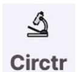

<div align="center">
  

  <h1>CIRCTR</h1>

  <p><strong>Circuit Analysis for Mechanistic Interpretability</strong></p>

  [](https://github.com/minutecoder34-cmd/Circtr/releases)
  [](LICENSE)
  [](https://github.com/minutecoder34-cmd/Circtr/releases)
  [](https://github.com/minutecoder34-cmd/Circtr/actions/workflows/release.yml)
  [](https://github.com/minutecoder34-cmd/Circtr/stargazers)
  [](https://github.com/minutecoder34-cmd/Circtr/network/members)

</div>

---

CIRCTR is a Windows desktop application for mechanistic interpretability researchers. Upload a PyTorch vision model and an image dataset, define a target behavior via positive and negative examples, and run four parallel circuit analysis methods to identify which layers, neurons, and attention heads are causally responsible for that behavior.

## Installation

Download the latest Windows installer from the [Releases](https://github.com/minutecoder34-cmd/Circtr/releases) page.

| Platform | Download |
|----------|----------|
| Windows 10 / 11 | `CIRCTR-Setup-<version>.exe` |

Run the installer and launch CIRCTR from the Start menu. No additional runtime dependencies required.

## Supported Formats

| Type | Formats |
|------|---------|
| Models | `.pt` `.pth` `.h5` `.onnx` `.pb` |
| Datasets | `.zip` `.tar` `.tar.gz` |

## Analysis Methods

CIRCTR runs all four methods in parallel on each analysis session:

| Method | Description |
|--------|-------------|
| **Gradient Attribution** | Ranks components by influence on the target behavior logit |
| **Activation Patching** | Measures causal effects by swapping intermediate activations |
| **Ablation Studies** | Removes components to quantify performance degradation |
| **Attention Analysis** | Surfaces selective heads and entropy (transformer models only) |

Overall importance is computed as a weighted average: gradient (40%), patching (30%), ablation (30%), attention (20%).

## Local Development

**Requirements:** Node.js 18+, [pnpm](https://pnpm.io)

```bash
pnpm install

# Browser development server (http://localhost:8080)
pnpm dev

# Electron desktop shell
pnpm electron:dev

# Lint
pnpm lint

# Production web build
pnpm build:prod
```

## Building the Installer

```bash
pnpm dist:win
```

Output is written to `release/`. Requires Windows or a Windows CI runner.

## Automated Releases

The workflow at `.github/workflows/release.yml` builds the NSIS installer and attaches it to the GitHub Release automatically on any push to a tag matching `v*`. Manual runs are also supported via `workflow_dispatch`.

To cut a release:

```bash
git tag v1.0.0
git push origin v1.0.0
```

## Tech Stack

| Layer | Technology |
|-------|-----------|
| UI | React 19, TypeScript, Vite |
| Components | shadcn/ui, Radix UI, Tailwind CSS |
| State | TanStack Query, React Hook Form, Zod |
| Routing | React Router v7 |
| Desktop | Electron 37 |
| Backend | Supabase (PostgreSQL, Storage, Edge Functions) |
| Packaging | electron-builder, GitHub Actions |

## Contributing

Pull requests are welcome. For significant changes, open an issue first to discuss the proposal.

1. Fork the repository
2. Create a feature branch (`git checkout -b feature/my-change`)
3. Commit your changes
4. Open a pull request

Please follow the coding conventions in [`CodeGuideline.md`](CodeGuideline.md).

## License

Released under the [MIT License](LICENSE).
